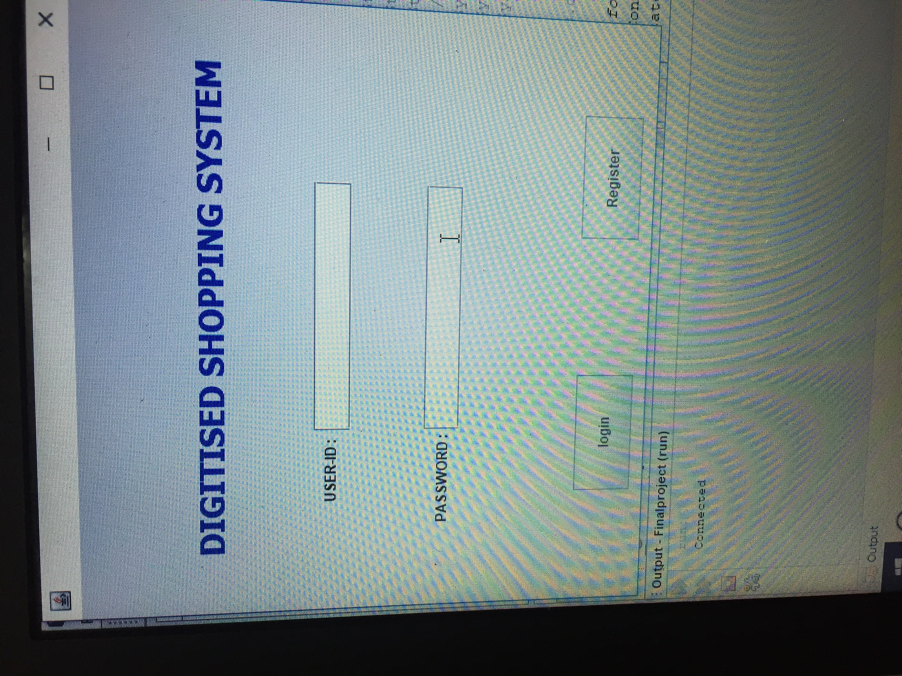
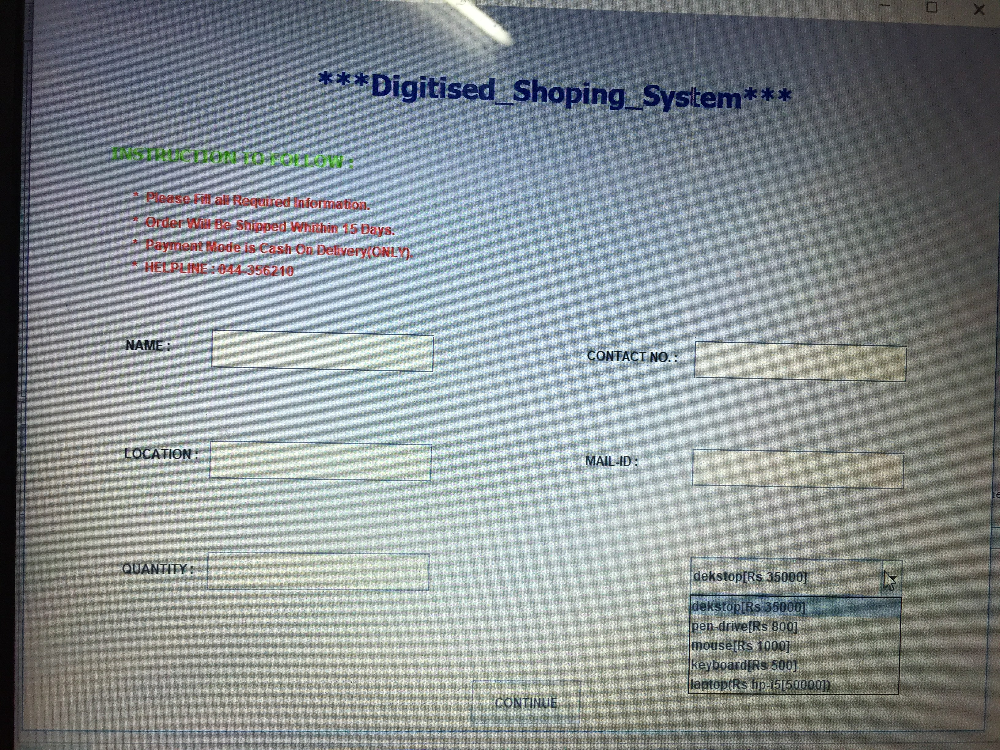
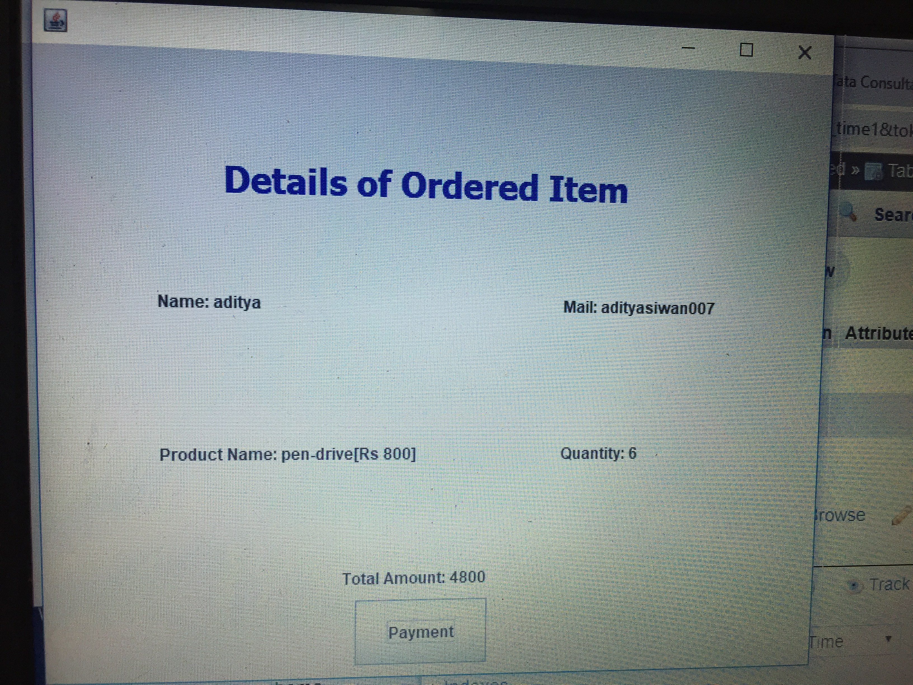
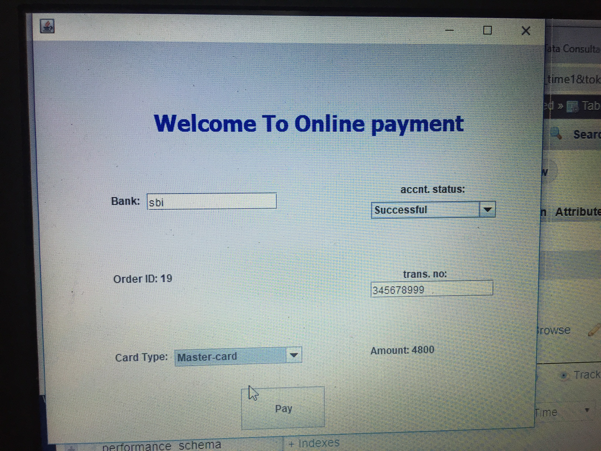

# java-swings-with-php-mysql-xampp
Based on online shopping simple interface using JAVA Swings and PHP Mysql XAMPP
# Demo step by step:

# Database structure (Create Exact same tables with sturctures) :

Use XAMPP server for this project.

   <b> Project name : digitised (list of all tables)<b>
    
   
    

   <h1> There are mainly 4 tables in data base </h1>
   
   1. information (table structure):
        
      
        
       
   2. login (table structure):
         
      
        
       
   3. payu (table structure):
        
      
        
       
   4. trigger_time1 (table structure):
        
      
        
       
       
       
